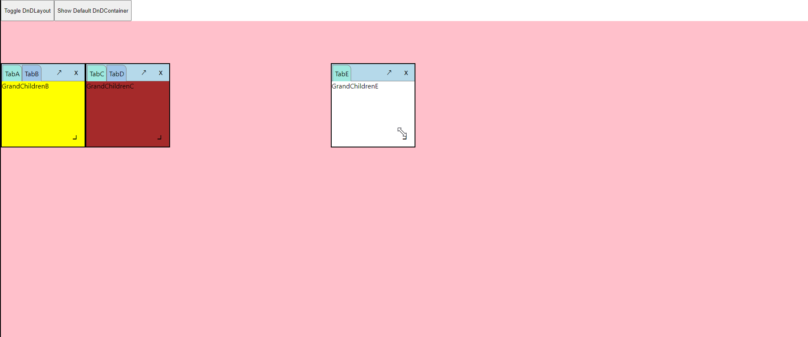

# dnd-box

> Drag and Drop Box

[](https://www.npmjs.com/package/dnd-box) [](https://standardjs.com)


dnd-box is a layout system that mimics those ones used in Photoshop, VisualStudio, AutoCad which sub windows could be placed, draged, resized, combined with another sub window by user.
dnd-box is React-only and does not require jQuery

dnd-box 提供了類似 Photoshop、VisualStudio、AutoCad 等桌面應用程式中，可由使用者任意拖曳、縮放、組合功能面版視窗的功能
dnd-box 僅需安裝 React，不須 jQuery 或其他程式庫

## Table of Contents

- [Demos](#demos)
- [Features](#features)
- [Install](#install)
- [Usage](#usage)
- [DnDLayout Props](#DnDLayout-Props)
- [DnDContainer Props](#DnDContainer-props)
- [Contribute](#contribute)

## Demos
- [Showcase](https://sosonian.github.io/dndboxdemo/)


- [THREE.js](https://sosonian.github.io/demotest/)


## Features
* Draggable box (sub window)
* Resizable box (sub window)
* Boxes (sub window) could be combined together or separated

## Install

```bash
npm install --save dnd-box
```

## Usage

如何使用

```jsx
import React, { Component } from 'react'
import { DnDLayout, DnDBackground, DnDContainer } from 'dnd-box'

class DemoApp extends Component {
    render() {
        let boxesSetting=[
            {
                boxID:1,
                width:200,
                height:200,
                x:0,
                y:100
            },
            {
                boxID:2
            }
        ]
        
        return (
            <DnDLayout width={1800} height={800}>
                <DnDBackground dndType={'DnDBackground'}>
                    {"This is background of layout"}
                <DnDBackground>
                <DnDContainer containerTabTitle={"TabA"} containerID={1} boxID={1}>
                    <div>
                        {"ChildrenComponentA"}
                    </div>
                </DnDContainer>
                <DnDContainer containerTabTitle={"TabB"} containerID={2} boxID={1}>
                    <div>
                        {"ChildrenComponentB"}
                    </div>
                </DnDContainer>
                <DnDContainer containerTabTitle={"TabC"} containerID={3} boxID={2}>
                    <div>
                        {"ChildrenComponentC"}
                    </div>
                </DnDContainer>            
            </DnDLayout>                    
        )
    }
}

export default DemoApp
```


## DnDLayout

It's the layout of dnd-box, the parent component of all box components. User could determine the width and height of it, and every box could not be dragged out of the layout (when box is collided the border of layout, box-dragging would be stopped).
State of every box would be stored in the state of DnDLayout, when box-dragging or container-dragging is finished, layout would pass the state throw the props 'getBoxesState' to parent component.

DnD 版面 (DnDLayout) 是所有子視窗的 parent component. 使用者可以定義版面的寬度、長度，之後當拖曳子視窗時，其不能超過版面的邊界，當子視窗跟版面邊界碰觸時，拖曳動作就會停止 (子視窗的放大動作邏輯也是一樣，碰觸版面邊界時，動作就會停止)。
所有子視窗的 state 會存在版面的 state 中，當拖曳或縮放動作完成時，版面會把所有子視窗的狀態透過 getBoxesState 這個 props 回傳至 DnDLayout的父元素。

List of Props of DnDLayout

DnDLayout 的 props 列表

### boxesSetting
Array of Object, each object is the initial state of box. Each box state has those attributes:
* boxID : String or number ,the ID of box. Input could be number or string, but must be unique. If ID is duplicate, second one would be assigned a new unique ID automatically (use uuidv4), and so is if ID is not given
* width : Number, the width of box (CSS property : width). If value is not a number,  or value is null, it would be assigned as 200 (200px).
* height : Number, the height of box (CSS property : height). If value is not a number,  or value is null, it would be assigned as 200 (200px).
* x : Number, the horizontal position of box (CSS property : left). If value is not a number,  or value is null, it would be given a valid value automatically.
* y : Number, the vertical position of box (CSS property : top). If value is not a number,  or value is null, it would be given a valid value automatically.

The number of box is determined by the length of Array.

輸入值是物件陣列(array of object). 每個物件代表的是子視窗(box)的初始狀態. 子視窗的初始狀態有下列屬性：
* boxID : 輸入值是字串或數字, 其為子視窗的ID, 但值必須是唯一值, 不與陣列中其他子視窗的ID重複. 如果重複, 重複的boxID會被自動指派一個新的唯一值. 如果ID是空值, 也會被自動指派一個新的唯一值 (使用 uuidv4).
* width : 數字, 子視窗的寬度. 如果輸入值不是數字, 或輸入值是 null, 子視窗的寬度將設為 200 (200px).
* height : 數字, 子視窗的寬度. 如果輸入值不是數字, 或輸入值是 null, 子視窗的寬度將設為 200 (200px).
* x : 數字，子視窗橫軸的位置 (等於CSS屬性left). 如果輸入值不是數字, 或輸入值是 null, 系統會自動給予一個數值.
* y : 數字，子視窗縱軸的位置 (等於CSS屬性Top). 如果輸入值不是數字, 或輸入值是 null, 系統會自動給予一個數值.

### backgroundColor
String, the backgroundColor of DnDLayout. Input should be a valid CSS background-color property: '#000000', 'black', 'rgb(0 0 0)'. 

輸入值是字串, 設定子視窗背景活動區域的背景色. 輸入值必須是一個有效的 CSS background-color 的值, 例如:'#000000', 'black', 'rgb(0 0 0)'.

### width
String or number, the width of DnDLayout. Input should be a valid CSS width property: 100, '100%', '100px', '100vw'. If input is null or is undeifined, the width of DnDLayout would be assigned as '100%'.

輸入值是字串或數值, 設定子視窗背景活動區域的寬度. 輸入值必須是一個有效的 CSS width 的值, 例如: 100, '100%', '100px', '100vw'. 如果不是有效值或是輸入值是 null, 子視窗背景活動區域的寬度將被設定為 '100%'.

### height
String or number, the height of DnDLayout. Input should be a valid CSS height property: 100, '100%', '100px', '100vw'. If input is null or is undeifined, the height of DnDLayout would be assigned as '100%'.

輸入值是字串或數值, 設定子視窗背景活動區域的高度. 輸入值必須是一個有效的 CSS height 的值, 例如: 100, '100%', '100px', '100vw'. 如果不是有效值或是輸入值是 null, 子視窗背景活動區域的高度將被設定為 '100%'.

### tabHeight
Number, the height of tab of box. If input is not valid number, the height of tab would be assigned as 20.

輸入值是數字, 設定子視窗標籤的高度. 如果輸入值不是數字, 預設標籤高度為 20.

### boxTabRadius
String, the border radius of tab. Input should be a valid value of CSS border-radius property: '0px 10px 0px 0px'.  

輸入值是字串, 設定子視窗標頭區域中標籤的 border-radius 的值. 輸入值需是一個有效的 CSS border-radius 的值, 例如: '0px 10px 0px 0px'.

### boxColor
String, the backgroundColor of box. Input should be a valid CSS background-color property: '#000000', 'black', 'rgb(0 0 0)'. If input is not given, the default color is '#5f9ea0'.

輸入值是字串, 設定子視窗的背景色. 輸入值必須是一個有效的 CSS background-color 的值, 例如:'#000000', 'black', 'rgb(0 0 0)'. 如果沒有輸入值, 預設的背景色是 '#5f9ea0'.

### boxHeaderColor
String, the backgroundColor of header of box. Input should be a valid CSS background-color property: '#000000', 'black', 'rgb(0 0 0)'. If input is not given, the default color is '#b6d9ea'.

輸入值是字串, 設定子視窗標頭區域的背景色. 輸入值必須是一個有效的 CSS background-color 的值, 例如:'#000000', 'black', 'rgb(0 0 0)'. 如果沒有輸入值, 預設的背景色是 '#b6d9ea'.

### boxTabColor
String, the backgroundColor of tab of box. Input should be a valid CSS background-color property: '#000000', 'black', 'rgb(0 0 0)'. If input is not given, the default color is '#9fc5e8'.

輸入值是字串, 設定子視窗標頭區域中標籤的背景色. 輸入值必須是一個有效的 CSS background-color 的值, 例如:'#000000', 'black', 'rgb(0 0 0)'. 如果沒有輸入值, 預設的背景色是 '#9fc5e8'.

### boxTabSelectedColor
String, the backgroundColor of selected tab of box. Input should be a valid CSS background-color property: '#000000', 'black', 'rgb(0 0 0)'. If input is not given, the default color is '#9fe8df'.

輸入值是字串, 設定子視窗標頭區域中, 已選取標籤的背景色. 輸入值必須是一個有效的 CSS background-color 的值, 例如:'#000000', 'black', 'rgb(0 0 0)'. 如果沒有輸入值, 預設的背景色是 '#9fe8df'.

### boxHeaderHoverColor
String, the backgroundColor of header of box when hovering. Input should be a valid CSS background-color property: '#000000', 'black', 'rgb(0 0 0)'. If input is not given, the default color is '#ff0000'.

輸入值是字串, 設定子視窗標頭區域當hover狀態時的背景色. 輸入值必須是一個有效的 CSS background-color 的值, 例如:'#000000', 'black', 'rgb(0 0 0)'. 如果沒有輸入值, 預設的背景色是 '#ff0000'.

### boxTabHoverColor
String, the backgroundColor of tab of box when hovering. Input should be a valid CSS background-color property: '#000000', 'black', 'rgb(0 0 0)'. If input is not given, the default color is '#00ff03'.

輸入值是字串, 設定子視窗標籤當hover狀態時的背景色. 輸入值必須是一個有效的 CSS background-color 的值, 例如:'#000000', 'black', 'rgb(0 0 0)'. 如果沒有輸入值, 預設的背景色是 '#00ff03'.

### iconHoverColor
String, the backgroundColor of cancel or expand icon when hovering. Input should be a valid CSS background-color property: '#000000', 'black', 'rgb(0 0 0)'. If input is not given, the default color is '#cff5ff'.

輸入值是字串, 設定子視窗右上角取消或縮放按鍵區域當hover狀態時的背景色. 輸入值必須是一個有效的 CSS background-color 的值, 例如:'#000000', 'black', 'rgb(0 0 0)'. 如果沒有輸入值, 預設的背景色是 '#cff5ff'.

### openContainer
Array of string or array of number, the list of ID of DnDContainer which would be toggled to show.

輸入值是字串陣列或數字陣列, 陣列中的值為功能區域(DnDContainer)的ID. 輸入後, 將顯示陣列中所列的功能區域.

### getBoxesState

under version 1.0.3:
Callback, when DnDLayout is unmounted, it would send back an array of the state of box. Attributes of box state:

version 1.0.4:
Callback, when dragging of tab of container complete, it would send back an array of the state of box. Attributes of box state:


* boxID : the ID of box, string or number.
* showing : toggle to show box or not, booling. True for showing the box, false to remove the box.
* zIndex : the z-index of box, number.
* position : position of box, object, attributes of position:
    x : the horizontal position of box, number.
    y : the vertical position of box, number.
* size : size of box, object, attributes of size:
    width : the width of box, number.
    height : the height of box, number.
* containerArray : containers which attach on the box, array of object, attributes of container: 
    containerID : the ID of container, string or number. 
    boxID : the ID of box which the container belong to, string or number.
    tab : the tab text of container, string.
    domObj : the child component of container, object.
* showingContainerIndex : index of container (tab) belongs to containerArray which is selected, number.

1.0.3 之前之版本:
輸出回傳, 當 DnDLayout unmounted 時, 會回傳一個有所有子視窗狀態的array. 子視窗狀態的屬性:

1.0.4 版本
當子視窗的標籤拖曳動作完成後，會回傳一個有所有子視窗狀態的arrayㄡ

* boxID : 子視窗ID, 字串或數字.
* showing : 子視窗顯示與否, 布林. 數值是true的話顯示子視窗, 數值是false的話移除子視窗.
* zIndex : 子視窗的z-index, 數字.
* position : 子視窗的位置, 物件, position的屬性有:
    x : 子視窗橫軸上的位置, 數字.
    y : 子視窗縱軸上的位置, 數字.
* size : 子視窗的大小, 物件, size的屬性有:
    width : 子視窗的寬度, 數字.
    height : 子視窗的高度, 數字.
* containerArray : 掛在此子視窗上的所有功能區塊列表, 物件陣列, 陣列中功能區塊的屬性有: 
    containerID : 功能區塊的ID, 字串或是數字. 
    boxID : 此功能區塊所在的子視窗的ID, 字串或是數字.
    tab : 此功能區塊的標籤名稱, 字串.
    domObj : 此功能區塊底下的子元件 (react component), 物件.
* showingContainerIndex : 此子視窗掛載的功能區塊中, 目前是為選取狀態的功能區塊, 其於 containerArray 中的 index, 數字.


## DnDBackground

It's the background or workplace component of dnd-box, like the canvas of Photoshop, or editor of Visual Studio, or workplace of Autocad. But dnd-box is ok without DnDBackground component.

DnDBackground 是 dnd-box 的背景元件，作用就像 Photoshop 的畫布、Visual Studio 的編輯器，或是 Autocad 中的工作區。如果使用者不使用 DnDBackground 也可以，子視窗一樣可以在版面上拖曳、縮放。

List of DnDBackground

DnDBackground的 props 列表


### dndType
String, the value must be 'DnDBackground', else background component would not be placed.

dndType 需輸入子串，且值必須是 'DnDBackground', 如果值不符合，或沒有，則 DnDBackground 元件就不會被設置。

## DnDContainer Props

List of Props of DnDContainer

DnDcontainer 的 props 列表

### containerTabTitle
String, the title of container.

字串，功能區塊的標籤名稱

### containerID

under version 1.0.3:
String or number, the ID of container. Input could be number or string, but must be unique. If ID is duplicate, second one would be assigned a new unique ID automatically (use uuidv4), and so is if ID is not given.

version 1.0.4:
String or number, the ID of container. Input could be number or string, but must be unique. If ID is duplicate or not given, this container would be omited.

1.0.3 以前之版本:
輸入值是字串或數字, 其為功能區塊的ID. 但值必須是唯一值, 不與其他功能區塊的ID重複. 如果重複, 重複的containerID會被自動指派一個新的唯一值. 如果ID是空值, 也會被自動指派一個新的唯一值 (使用 uuidv4).

1.0.4 版本:
輸入值是字串或數字, 其為功能區塊的ID. 但值必須是唯一值, 不與其他功能區塊的ID重複. 如果重複, 子視窗 (container) 會被忽略不會出現.

### boxID
String or number, the ID of box which this container belongs to.

輸入值是字串或數字, 其為功能區塊將掛載的子視窗的ID.


## License

MIT © [sosonian](https://github.com/sosonian)
